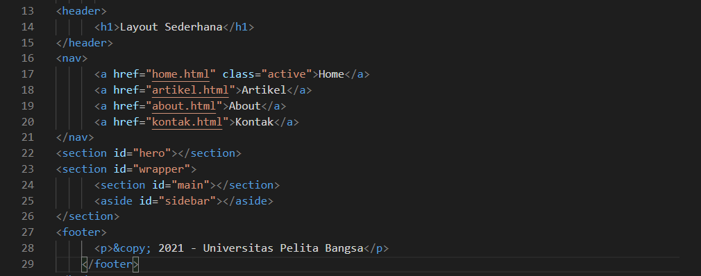

# Lab4Web
| Nama      | Lydia Diffani Siregar |
| ----------- | ----------- |
| NIM     | 312010498       |
| Kelas   | TI.20.A.1        |

## Langkah langkah praktikum 4
1. Pertama - tama membuka VSC 

2. Kemudian membuat dokumen HTML dengan nama file <strong> lab4_box.html </strong>

Ini hasil di Microsoft Edge nya

3. Kemudian tambahkan kode untuk membuat box element dengan tag div seperti berikut.

4. Selanjutnya tambahkan deklarasi CSS pada head untuk membuat float element, seperti berikut.

Ini hasil di Microsoft Edge nya

5. Mengatur Clearfix Element
Clearfix digunakan untuk mengatur element setelah float element. Property clear digunakan untuk mengaturnya.

Tambahkan element div lainnya seteleah div3 seperti berikut.

Kemudian atur property clear pada CSS, seperti berikut.

Ini hasil di Microsoft Edge nya

Saya akan melakukan eksperimen terhadap penggunaan property clear dengan nilai lainnya <strong> (left, both, right) </strong>, dan amati perubahannya.

<strong> Membuat Layout Sederhana </strong>
Buat folder baru dengan nama lab4_layout, kemudian buatlah file baru didalamnya dengan nama home.html, dan file css dengan nama style.css.

Kemudian tulislah kode berikut.

Ini hasil di Microsoft Edge nya

Kemudian tambahkan kode CSS untuk membuat layoutnya.

Ini hasil di Microsoft Edge nya

<strong> Membuat Navigasi </strong>
Kemudian selanjutnya mengatur navigasi.

Ini hasil di Microsoft Edge nya

<strong> Membuat Hero Panel </strong>
Selanjutnya membuat hero panel. Tambahkan kode HTML dan CSS seperti berikut.

Ini hasil di Microsoft Edge nya

<strong> Mengatur Layout Main dan Sidebar</strong>
Selanjutnya mengatur main content dan sidebar, tambahkan CSS float.

<strong> Membuat Sidebar Widget </strong>
Kemudian selanjutnya menambahkan element lain dalam sidebar.

Kemudian tambahkan CSS.

Ini hasil di Microsoft Edge nya

<strong > Mengatur Footer </strong>
Selanjutnya mengatur tampilan footer. Tambahkan CSS untuk footer.

Ini hasil di Microsoft Edge nya

<strong> Menambahkan Elemen lainnya pada Main Content </strong>

Kemudian tambahkan CSS.

Ini hasil di Microsoft Edge nya

<strong> Menambahkan Content Artikel </strong>
Selanjutnya membuat content artikel. Tambahkan HTML berikut pada main content.

Kemudian tambahkan CSS.

Ini hasil di Microsoft Edge nya

# Pertanyaan dan Tugas
1. Tambahkan Layout untuk menu About => buat single layout yang berisi deskripsi, portfolio, dll.
2. Tambahkan layout untuk menu Contact => yang berisi form isian: nama, email, message, dll.

## Jawab
1. Pertama tama buatlah HTML seperti berikut

Kemudian tambahkan CSS.

Ini hasil di Microsoft Edge nya

2. Buatlah HTML seperti berikut

Kemuadian tambahkan CSS

Ini hasil di Microsoft Edge nya

